```mermaid
flowchart TB
    subgraph upstream["Dependants (2)"]
        P6["<b>📦&nbsp;DBMigrator.Aspire.Tests.csproj</b><br/><small>net9.0</small>"]
        P7["<b>📦&nbsp;DBMigrator.Aspire.Example.csproj</b><br/><small>net9.0</small>"]
        click P6 "#dbmigratoraspiretestsdbmigratoraspiretestscsproj"
        click P7 "#examplesdbmigratoraspireexampledbmigratoraspireexamplecsproj"
    end
    subgraph current["DBMigrator.Aspire.Hosting.csproj"]
        MAIN["<b>📦&nbsp;DBMigrator.Aspire.Hosting.csproj</b><br/><small>net9.0</small>"]
        click MAIN "#dbmigratoraspirehostingdbmigratoraspirehostingcsproj"
    end
    subgraph downstream["Dependencies (1"]
        P2["<b>📦&nbsp;DBMigrator.csproj</b><br/><small>net6.0;netstandard2.0;net9.0</small>"]
        click P2 "#dbmigratordbmigratorcsproj"
    end
    P6 --> MAIN
    P7 --> MAIN
    MAIN --> P2

```

```mermaid
flowchart TB
    subgraph current["DBMigrator.Aspire.Tests.csproj"]
        MAIN["<b>📦&nbsp;DBMigrator.Aspire.Tests.csproj</b><br/><small>net9.0</small>"]
        click MAIN "#dbmigratoraspiretestsdbmigratoraspiretestscsproj"
    end
    subgraph downstream["Dependencies (2"]
        P5["<b>📦&nbsp;DBMigrator.Aspire.Hosting.csproj</b><br/><small>net9.0</small>"]
        P2["<b>📦&nbsp;DBMigrator.csproj</b><br/><small>net6.0;netstandard2.0;net9.0</small>"]
        click P5 "#dbmigratoraspirehostingdbmigratoraspirehostingcsproj"
        click P2 "#dbmigratordbmigratorcsproj"
    end
    MAIN --> P5
    MAIN --> P2

```

```mermaid
flowchart TB
    subgraph current["DBMigrator.Console.csproj"]
        MAIN["<b>📦&nbsp;DBMigrator.Console.csproj</b><br/><small>net9.0</small>"]
        click MAIN "#dbmigratorconsoledbmigratorconsolecsproj"
    end
    subgraph downstream["Dependencies (1"]
        P2["<b>📦&nbsp;DBMigrator.csproj</b><br/><small>net6.0;netstandard2.0;net9.0</small>"]
        click P2 "#dbmigratordbmigratorcsproj"
    end
    MAIN --> P2

```

```mermaid
flowchart TB
    subgraph current["DBMigrator.Test.csproj"]
        MAIN["<b>📦&nbsp;DBMigrator.Test.csproj</b><br/><small>net9.0</small>"]
        click MAIN "#dbmigratortestdbmigratortestcsproj"
    end
    subgraph downstream["Dependencies (1"]
        P2["<b>📦&nbsp;DBMigrator.csproj</b><br/><small>net6.0;netstandard2.0;net9.0</small>"]
        click P2 "#dbmigratordbmigratorcsproj"
    end
    MAIN --> P2

```

```mermaid
flowchart TB
    subgraph current["DBMigrator.Aspire.Example.csproj"]
        MAIN["<b>📦&nbsp;DBMigrator.Aspire.Example.csproj</b><br/><small>net9.0</small>"]
        click MAIN "#examplesdbmigratoraspireexampledbmigratoraspireexamplecsproj"
    end
    subgraph downstream["Dependencies (1"]
        P5["<b>📦&nbsp;DBMigrator.Aspire.Hosting.csproj</b><br/><small>net9.0</small>"]
        click P5 "#dbmigratoraspirehostingdbmigratoraspirehostingcsproj"
    end
    MAIN --> P5

```

# Projects and dependencies analysis

This document provides a comprehensive overview of the projects and their dependencies in the context of upgrading to .NET 9.0.

## Table of Contents

- [Projects Relationship Graph](#projects-relationship-graph)
- [Project Details](#project-details)

  - [DBMigrator.Aspire.Hosting\DBMigrator.Aspire.Hosting.csproj](#dbmigratoraspirehostingdbmigratoraspirehostingcsproj)
  - [DBMigrator.Aspire.Tests\DBMigrator.Aspire.Tests.csproj](#dbmigratoraspiretestsdbmigratoraspiretestscsproj)
  - [DBMigrator.Console\DBMigrator.Console.csproj](#dbmigratorconsoledbmigratorconsolecsproj)
  - [DBMigrator.Test\DBMigrator.Test.csproj](#dbmigratortestdbmigratortestcsproj)
  - [DBMigrator\DBMigrator.csproj](#dbmigratordbmigratorcsproj)
  - [Examples\DBMigrator.Aspire.Example\DBMigrator.Aspire.Example.csproj](#examplesdbmigratoraspireexampledbmigratoraspireexamplecsproj)
- [Aggregate NuGet packages details](#aggregate-nuget-packages-details)

## Projects Relationship Graph

Legend:
📦 SDK-style project
⚙️ Classic project

## Project Details

### DBMigrator.Aspire.Hosting\DBMigrator.Aspire.Hosting.csproj

#### Project Info

- **Current Target Framework:** net9.0
- **Proposed Target Framework:** net10.0
- **SDK-style**: True
- **Project Kind:** ClassLibrary
- **Dependencies**: 1
- **Dependants**: 2
- **Number of Files**: 5
- **Lines of Code**: 356

#### Dependency Graph

Legend:
📦 SDK-style project
⚙️ Classic project

#### Project Package References

| Package | Type | Current Version | Suggested Version | Description |
| :--- | :---: | :---: | :---: | :--- |
| Aspire.Hosting | Explicit | 9.0.0 |  | Needs to be replaced with Replace with new package Aspire.Hosting.AppHost=13.0.0 |
| Aspire.Hosting.SqlServer | Explicit | 9.0.0 | 13.0.0 | NuGet package upgrade is recommended |
| Microsoft.Data.SqlClient | Explicit | 5.2.2 |  | ✅Compatible |

### DBMigrator.Aspire.Tests\DBMigrator.Aspire.Tests.csproj

#### Project Info

- **Current Target Framework:** net9.0
- **Proposed Target Framework:** net10.0
- **SDK-style**: True
- **Project Kind:** DotNetCoreApp
- **Dependencies**: 2
- **Dependants**: 0
- **Number of Files**: 3
- **Lines of Code**: 125

#### Dependency Graph

Legend:
📦 SDK-style project
⚙️ Classic project

#### Project Package References

| Package | Type | Current Version | Suggested Version | Description |
| :--- | :---: | :---: | :---: | :--- |
| Aspire.Hosting.SqlServer | Explicit | 9.0.0 | 13.0.0 | NuGet package upgrade is recommended |
| Aspire.Hosting.Testing | Explicit | 9.0.0 | 13.0.0 | NuGet package upgrade is recommended |
| Microsoft.NET.Test.Sdk | Explicit | 17.11.0 |  | ✅Compatible |
| MSTest.TestAdapter | Explicit | 3.6.0 |  | ✅Compatible |
| MSTest.TestFramework | Explicit | 3.6.0 |  | ✅Compatible |

### DBMigrator.Console\DBMigrator.Console.csproj

#### Project Info

- **Current Target Framework:** net9.0
- **Proposed Target Framework:** net10.0
- **SDK-style**: True
- **Project Kind:** DotNetCoreApp
- **Dependencies**: 1
- **Dependants**: 0
- **Number of Files**: 1
- **Lines of Code**: 306

#### Dependency Graph

Legend:
📦 SDK-style project
⚙️ Classic project

#### Project Package References

| Package | Type | Current Version | Suggested Version | Description |
| :--- | :---: | :---: | :---: | :--- |
| Microsoft.Extensions.CommandLineUtils | Explicit | 1.1.1 |  | ⚠️NuGet package is deprecated |
| Microsoft.Extensions.DependencyInjection | Explicit | 9.0.0 | 10.0.0 | NuGet package upgrade is recommended |
| Microsoft.Extensions.Logging | Explicit | 9.0.0 | 10.0.0 | NuGet package upgrade is recommended |
| Microsoft.Extensions.Logging.Console | Explicit | 9.0.0 | 10.0.0 | NuGet package upgrade is recommended |
| Microsoft.Extensions.Logging.Debug | Explicit | 9.0.0 | 10.0.0 | NuGet package upgrade is recommended |
| Nerdbank.GitVersioning | Explicit | 3.6.133 |  | ✅Compatible |

### DBMigrator.Test\DBMigrator.Test.csproj

#### Project Info

- **Current Target Framework:** net9.0
- **Proposed Target Framework:** net10.0
- **SDK-style**: True
- **Project Kind:** DotNetCoreApp
- **Dependencies**: 1
- **Dependants**: 0
- **Number of Files**: 20
- **Lines of Code**: 821

#### Dependency Graph

Legend:
📦 SDK-style project
⚙️ Classic project

#### Project Package References

| Package | Type | Current Version | Suggested Version | Description |
| :--- | :---: | :---: | :---: | :--- |
| Microsoft.NET.Test.Sdk | Explicit | 16.7.1 |  | ✅Compatible |
| MSTest.TestAdapter | Explicit | 2.1.2 |  | ✅Compatible |
| MSTest.TestFramework | Explicit | 2.1.2 |  | ✅Compatible |

### DBMigrator\DBMigrator.csproj

#### Project Info

- **Current Target Framework:** net6.0;netstandard2.0;net9.0
- **Proposed Target Framework:** net6.0;netstandard2.0;net9.0;net10.0
- **SDK-style**: True
- **Project Kind:** ClassLibrary
- **Dependencies**: 0
- **Dependants**: 4
- **Number of Files**: 25
- **Lines of Code**: 1704

#### Dependency Graph

Legend:
📦 SDK-style project
⚙️ Classic project

#### Project Package References

| Package | Type | Current Version | Suggested Version | Description |
| :--- | :---: | :---: | :---: | :--- |
| Microsoft.Extensions.DependencyInjection | Explicit | 9.0.0 | 10.0.0 | NuGet package upgrade is recommended |
| Microsoft.Extensions.DependencyInjection.Abstractions | Explicit | 9.0.0 | 10.0.0 | NuGet package upgrade is recommended |
| Microsoft.Extensions.Logging | Explicit | 9.0.0 | 10.0.0 | NuGet package upgrade is recommended |
| Microsoft.Extensions.Logging.Abstractions | Explicit | 9.0.0 | 10.0.0 | NuGet package upgrade is recommended |
| Microsoft.Extensions.Logging.Console | Explicit | 9.0.0 | 10.0.0 | NuGet package upgrade is recommended |
| Microsoft.Extensions.Logging.Debug | Explicit | 9.0.0 | 10.0.0 | NuGet package upgrade is recommended |
| System.Data.SqlClient | Explicit | 4.9.0 |  | ✅Compatible |

### Examples\DBMigrator.Aspire.Example\DBMigrator.Aspire.Example.csproj

#### Project Info

- **Current Target Framework:** net9.0
- **Proposed Target Framework:** net10.0
- **SDK-style**: True
- **Project Kind:** DotNetCoreApp
- **Dependencies**: 1
- **Dependants**: 0
- **Number of Files**: 1
- **Lines of Code**: 22

#### Dependency Graph

Legend:
📦 SDK-style project
⚙️ Classic project

#### Project Package References

| Package | Type | Current Version | Suggested Version | Description |
| :--- | :---: | :---: | :---: | :--- |
| Aspire.Hosting.AppHost | Explicit | 9.0.0 | 13.0.0 | NuGet package upgrade is recommended |
| Aspire.Hosting.SqlServer | Explicit | 9.0.0 | 13.0.0 | NuGet package upgrade is recommended |

## Aggregate NuGet packages details

| Package | Current Version | Suggested Version | Projects | Description |
| :--- | :---: | :---: | :--- | :--- |
| Aspire.Hosting | 9.0.0 |  | [DBMigrator.Aspire.Hosting.csproj](#dbmigratoraspirehostingcsproj) | Needs to be replaced with Replace with new package Aspire.Hosting.AppHost=13.0.0 |
| Aspire.Hosting.AppHost | 9.0.0 | 13.0.0 | [DBMigrator.Aspire.Example.csproj](#dbmigratoraspireexamplecsproj) | NuGet package upgrade is recommended |
| Aspire.Hosting.SqlServer | 9.0.0 | 13.0.0 | [DBMigrator.Aspire.Hosting.csproj](#dbmigratoraspirehostingcsproj) [DBMigrator.Aspire.Tests.csproj](#dbmigratoraspiretestscsproj) [DBMigrator.Aspire.Example.csproj](#dbmigratoraspireexamplecsproj) | NuGet package upgrade is recommended |
| Aspire.Hosting.Testing | 9.0.0 | 13.0.0 | [DBMigrator.Aspire.Tests.csproj](#dbmigratoraspiretestscsproj) | NuGet package upgrade is recommended |
| Microsoft.Data.SqlClient | 5.2.2 |  | [DBMigrator.Aspire.Hosting.csproj](#dbmigratoraspirehostingcsproj) | ✅Compatible |
| Microsoft.Extensions.CommandLineUtils | 1.1.1 |  | [DBMigrator.Console.csproj](#dbmigratorconsolecsproj) | ⚠️NuGet package is deprecated |
| Microsoft.Extensions.DependencyInjection | 9.0.0 | 10.0.0 | [DBMigrator.Console.csproj](#dbmigratorconsolecsproj) [DBMigrator.csproj](#dbmigratorcsproj) | NuGet package upgrade is recommended |
| Microsoft.Extensions.DependencyInjection.Abstractions | 9.0.0 | 10.0.0 | [DBMigrator.csproj](#dbmigratorcsproj) | NuGet package upgrade is recommended |
| Microsoft.Extensions.Logging | 9.0.0 | 10.0.0 | [DBMigrator.Console.csproj](#dbmigratorconsolecsproj) [DBMigrator.csproj](#dbmigratorcsproj) | NuGet package upgrade is recommended |
| Microsoft.Extensions.Logging.Abstractions | 9.0.0 | 10.0.0 | [DBMigrator.csproj](#dbmigratorcsproj) | NuGet package upgrade is recommended |
| Microsoft.Extensions.Logging.Console | 9.0.0 | 10.0.0 | [DBMigrator.Console.csproj](#dbmigratorconsolecsproj) [DBMigrator.csproj](#dbmigratorcsproj) | NuGet package upgrade is recommended |
| Microsoft.Extensions.Logging.Debug | 9.0.0 | 10.0.0 | [DBMigrator.Console.csproj](#dbmigratorconsolecsproj) [DBMigrator.csproj](#dbmigratorcsproj) | NuGet package upgrade is recommended |
| Microsoft.NET.Test.Sdk | 16.7.1 |  | [DBMigrator.Test.csproj](#dbmigratortestcsproj) | ✅Compatible |
| Microsoft.NET.Test.Sdk | 17.11.0 |  | [DBMigrator.Aspire.Tests.csproj](#dbmigratoraspiretestscsproj) | ✅Compatible |
| MSTest.TestAdapter | 2.1.2 |  | [DBMigrator.Test.csproj](#dbmigratortestcsproj) | ✅Compatible |
| MSTest.TestAdapter | 3.6.0 |  | [DBMigrator.Aspire.Tests.csproj](#dbmigratoraspiretestscsproj) | ✅Compatible |
| MSTest.TestFramework | 2.1.2 |  | [DBMigrator.Test.csproj](#dbmigratortestcsproj) | ✅Compatible |
| MSTest.TestFramework | 3.6.0 |  | [DBMigrator.Aspire.Tests.csproj](#dbmigratoraspiretestscsproj) | ✅Compatible |
| Nerdbank.GitVersioning | 3.6.133 |  | [DBMigrator.Console.csproj](#dbmigratorconsolecsproj) | ✅Compatible |
| System.Data.SqlClient | 4.9.0 |  | [DBMigrator.csproj](#dbmigratorcsproj) | ✅Compatible |

