```mermaid
flowchart TB
    subgraph current["DBMigrator.Console.csproj"]
        MAIN["<b>📦&nbsp;DBMigrator.Console.csproj</b><br/><small>net472</small>"]
        click MAIN "#dbmigratorconsoledbmigratorconsolecsproj"
    end
    subgraph downstream["Dependencies (1"]
        P2["<b>📦&nbsp;DBMigrator.csproj</b><br/><small>net6.0;netstandard2.0</small>"]
        click P2 "#dbmigratordbmigratorcsproj"
    end
    MAIN --> P2

```

```mermaid
flowchart TB
    subgraph current["DBMigrator.Test.csproj"]
        MAIN["<b>📦&nbsp;DBMigrator.Test.csproj</b><br/><small>net5.0</small>"]
        click MAIN "#dbmigratortestdbmigratortestcsproj"
    end
    subgraph downstream["Dependencies (1"]
        P2["<b>📦&nbsp;DBMigrator.csproj</b><br/><small>net6.0;netstandard2.0</small>"]
        click P2 "#dbmigratordbmigratorcsproj"
    end
    MAIN --> P2

```

```mermaid
flowchart TB
    subgraph upstream["Dependants (2)"]
        P1["<b>📦&nbsp;DBMigrator.Console.csproj</b><br/><small>net472</small>"]
        P3["<b>📦&nbsp;DBMigrator.Test.csproj</b><br/><small>net5.0</small>"]
        click P1 "#dbmigratorconsoledbmigratorconsolecsproj"
        click P3 "#dbmigratortestdbmigratortestcsproj"
    end
    subgraph current["DBMigrator.csproj"]
        MAIN["<b>📦&nbsp;DBMigrator.csproj</b><br/><small>net6.0;netstandard2.0</small>"]
        click MAIN "#dbmigratordbmigratorcsproj"
    end
    P1 --> MAIN
    P3 --> MAIN

```

```mermaid
flowchart TB
    subgraph current["DBMigratorVsix.csproj"]
        MAIN["<b>⚙️&nbsp;DBMigratorVsix.csproj</b><br/><small>.NETFramework,Version=v4.7.2</small>"]
        click MAIN "#dbmigratorvsixdbmigratorvsixcsproj"
    end

```

# Projects and dependencies analysis

This document provides a comprehensive overview of the projects and their dependencies in the context of upgrading to .NET 9.0.

## Table of Contents

- [Projects Relationship Graph](#projects-relationship-graph)
- [Project Details](#project-details)

  - [DBMigrator.Console\DBMigrator.Console.csproj](#dbmigratorconsoledbmigratorconsolecsproj)
  - [DBMigrator.Test\DBMigrator.Test.csproj](#dbmigratortestdbmigratortestcsproj)
  - [DBMigrator\DBMigrator.csproj](#dbmigratordbmigratorcsproj)
  - [DBMigratorVsix\DBMigratorVsix.csproj](#dbmigratorvsixdbmigratorvsixcsproj)
- [Aggregate NuGet packages details](#aggregate-nuget-packages-details)

## Projects Relationship Graph

Legend:
📦 SDK-style project
⚙️ Classic project

```mermaid
flowchart LR
    P1["<b>📦&nbsp;DBMigrator.Console.csproj</b><br/><small>net472</small>"]
    P2["<b>📦&nbsp;DBMigrator.csproj</b><br/><small>net6.0;netstandard2.0</small>"]
    P3["<b>📦&nbsp;DBMigrator.Test.csproj</b><br/><small>net5.0</small>"]
    P4["<b>⚙️&nbsp;DBMigratorVsix.csproj</b><br/><small>.NETFramework,Version=v4.7.2</small>"]
    P1 --> P2
    P3 --> P2
    click P1 "#dbmigratorconsoledbmigratorconsolecsproj"
    click P2 "#dbmigratordbmigratorcsproj"
    click P3 "#dbmigratortestdbmigratortestcsproj"
    click P4 "#dbmigratorvsixdbmigratorvsixcsproj"

```

## Project Details

### DBMigrator.Console\DBMigrator.Console.csproj

#### Project Info

- **Current Target Framework:** net472
- **Proposed Target Framework:** net9.0
- **SDK-style**: True
- **Project Kind:** DotNetCoreApp
- **Dependencies**: 1
- **Dependants**: 0
- **Number of Files**: 1
- **Lines of Code**: 306

#### Dependency Graph

Legend:
📦 SDK-style project
⚙️ Classic project

#### Project Package References

| Package | Type | Current Version | Suggested Version | Description |
| :--- | :---: | :---: | :---: | :--- |
| Microsoft.Extensions.CommandLineUtils | Explicit | 1.1.1 |  | ⚠️NuGet package is deprecated |
| Microsoft.Extensions.DependencyInjection | Explicit | 3.1.8 | 9.0.11 | NuGet package upgrade is recommended |
| Microsoft.Extensions.Logging | Explicit | 3.1.8 | 9.0.11 | NuGet package upgrade is recommended |
| Microsoft.Extensions.Logging.Console | Explicit | 3.1.8 | 9.0.11 | NuGet package upgrade is recommended |
| Microsoft.Extensions.Logging.Debug | Explicit | 3.1.8 | 9.0.11 | NuGet package upgrade is recommended |
| Nerdbank.GitVersioning | Explicit | 3.6.133 |  | ✅Compatible |

### DBMigrator.Test\DBMigrator.Test.csproj

#### Project Info

- **Current Target Framework:** net5.0
- **Proposed Target Framework:** net9.0
- **SDK-style**: True
- **Project Kind:** DotNetCoreApp
- **Dependencies**: 1
- **Dependants**: 0
- **Number of Files**: 20
- **Lines of Code**: 821

#### Dependency Graph

Legend:
📦 SDK-style project
⚙️ Classic project

#### Project Package References

| Package | Type | Current Version | Suggested Version | Description |
| :--- | :---: | :---: | :---: | :--- |
| Microsoft.NET.Test.Sdk | Explicit | 16.7.1 |  | ✅Compatible |
| MSTest.TestAdapter | Explicit | 2.1.2 |  | ✅Compatible |
| MSTest.TestFramework | Explicit | 2.1.2 |  | ✅Compatible |
| System.Runtime.Extensions | Explicit | 4.3.1 |  | NuGet package functionality is included with framework reference |

### DBMigrator\DBMigrator.csproj

#### Project Info

- **Current Target Framework:** net6.0;netstandard2.0
- **Proposed Target Framework:** net6.0;netstandard2.0;net9.0
- **SDK-style**: True
- **Project Kind:** ClassLibrary
- **Dependencies**: 0
- **Dependants**: 2
- **Number of Files**: 25
- **Lines of Code**: 1704

#### Dependency Graph

Legend:
📦 SDK-style project
⚙️ Classic project

#### Project Package References

| Package | Type | Current Version | Suggested Version | Description |
| :--- | :---: | :---: | :---: | :--- |
| Microsoft.Extensions.DependencyInjection | Explicit | 3.1.8 | 9.0.11 | NuGet package upgrade is recommended |
| Microsoft.Extensions.DependencyInjection.Abstractions | Explicit | 3.1.8 | 9.0.11 | NuGet package upgrade is recommended |
| Microsoft.Extensions.Logging | Explicit | 3.1.8 | 9.0.11 | NuGet package upgrade is recommended |
| Microsoft.Extensions.Logging.Abstractions | Explicit | 3.1.8 | 9.0.11 | NuGet package upgrade is recommended |
| Microsoft.Extensions.Logging.Console | Explicit | 3.1.8 | 9.0.11 | NuGet package upgrade is recommended |
| Microsoft.Extensions.Logging.Debug | Explicit | 3.1.8 | 9.0.11 | NuGet package upgrade is recommended |
| System.Data.SqlClient | Explicit | 4.8.2 | 4.9.0 | NuGet package contains security vulnerability |
| System.ValueTuple | Explicit | 4.5.0 |  | NuGet package functionality is included with framework reference |

### DBMigratorVsix\DBMigratorVsix.csproj

#### Project Info

- **Current Target Framework:** .NETFramework,Version=v4.7.2
- **Proposed Target Framework:** net9.0-windows
- **SDK-style**: False
- **Project Kind:** ClassicWpf
- **Dependencies**: 0
- **Dependants**: 0
- **Number of Files**: 7
- **Lines of Code**: 367

#### Dependency Graph

Legend:
📦 SDK-style project
⚙️ Classic project

#### Project Package References

| Package | Type | Current Version | Suggested Version | Description |
| :--- | :---: | :---: | :---: | :--- |
| Microsoft.VisualStudio.SDK | Explicit | 16.0.206 |  | ✅Compatible |
| Microsoft.VSSDK.BuildTools | Explicit | 16.7.3069 | 15.7.104 | ⚠️NuGet package is incompatible |

## Aggregate NuGet packages details

| Package | Current Version | Suggested Version | Projects | Description |
| :--- | :---: | :---: | :--- | :--- |
| Microsoft.Extensions.CommandLineUtils | 1.1.1 |  | [DBMigrator.Console.csproj](#dbmigratorconsolecsproj) | ⚠️NuGet package is deprecated |
| Microsoft.Extensions.DependencyInjection | 3.1.8 | 9.0.11 | [DBMigrator.Console.csproj](#dbmigratorconsolecsproj) [DBMigrator.csproj](#dbmigratorcsproj) | NuGet package upgrade is recommended |
| Microsoft.Extensions.DependencyInjection.Abstractions | 3.1.8 | 9.0.11 | [DBMigrator.csproj](#dbmigratorcsproj) | NuGet package upgrade is recommended |
| Microsoft.Extensions.Logging | 3.1.8 | 9.0.11 | [DBMigrator.Console.csproj](#dbmigratorconsolecsproj) [DBMigrator.csproj](#dbmigratorcsproj) | NuGet package upgrade is recommended |
| Microsoft.Extensions.Logging.Abstractions | 3.1.8 | 9.0.11 | [DBMigrator.csproj](#dbmigratorcsproj) | NuGet package upgrade is recommended |
| Microsoft.Extensions.Logging.Console | 3.1.8 | 9.0.11 | [DBMigrator.Console.csproj](#dbmigratorconsolecsproj) [DBMigrator.csproj](#dbmigratorcsproj) | NuGet package upgrade is recommended |
| Microsoft.Extensions.Logging.Debug | 3.1.8 | 9.0.11 | [DBMigrator.Console.csproj](#dbmigratorconsolecsproj) [DBMigrator.csproj](#dbmigratorcsproj) | NuGet package upgrade is recommended |
| Microsoft.NET.Test.Sdk | 16.7.1 |  | [DBMigrator.Test.csproj](#dbmigratortestcsproj) | ✅Compatible |
| Microsoft.VisualStudio.SDK | 16.0.206 |  | [DBMigratorVsix.csproj](#dbmigratorvsixcsproj) | ✅Compatible |
| Microsoft.VSSDK.BuildTools | 16.7.3069 | 15.7.104 | [DBMigratorVsix.csproj](#dbmigratorvsixcsproj) | ⚠️NuGet package is incompatible |
| MSTest.TestAdapter | 2.1.2 |  | [DBMigrator.Test.csproj](#dbmigratortestcsproj) | ✅Compatible |
| MSTest.TestFramework | 2.1.2 |  | [DBMigrator.Test.csproj](#dbmigratortestcsproj) | ✅Compatible |
| Nerdbank.GitVersioning | 3.6.133 |  | [DBMigrator.Console.csproj](#dbmigratorconsolecsproj) | ✅Compatible |
| System.Data.SqlClient | 4.8.2 | 4.9.0 | [DBMigrator.csproj](#dbmigratorcsproj) | NuGet package contains security vulnerability |
| System.Runtime.Extensions | 4.3.1 |  | [DBMigrator.Test.csproj](#dbmigratortestcsproj) | NuGet package functionality is included with framework reference |
| System.ValueTuple | 4.5.0 |  | [DBMigrator.csproj](#dbmigratorcsproj) | NuGet package functionality is included with framework reference |

